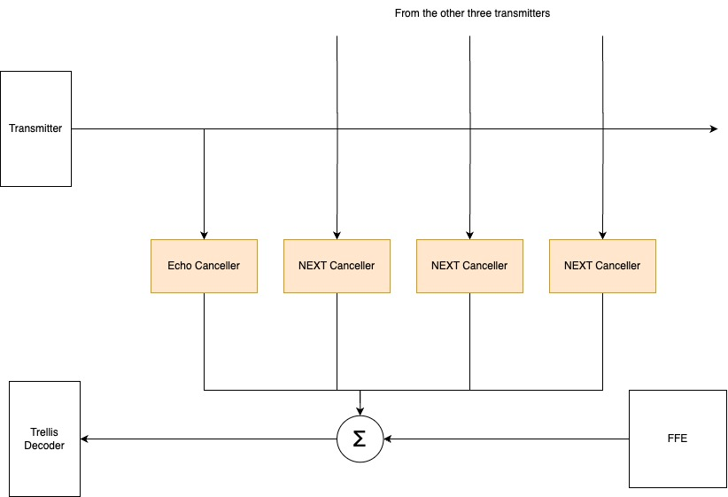
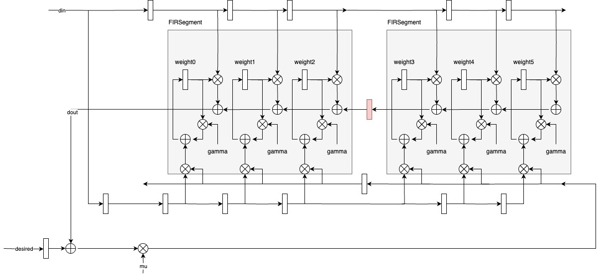

# Echo and NEXT Cancellers
### For EECS 251B Final Project - Ethernet

This is an implementation of echo and near-end crosstalk (NEXT) cancellers for a 1000Base-T Ethernet implementation. 



## Specification

We designed adaptive FIR filters to filter our noise introduced by echo and NEXT. Our weight adaptation algorithm is the tap-leakage least mean square (LMS) algorithm. This keeps our weight registers small and reduces delay from arithmetic.

Currently, our design uses six taps for echo and NEXT, and it has $\gamma_{echo} = \gamma_{NEXT} = 2^{-5}$ and $\mu_{echo} = \mu_{NEXT} = 0.5$.



## Parameters
* `echoTapCount` : How many taps to use in the echo canceller.
* `nextTapCount` : How many taps to use in the NEXT cancellers.
* `segSizeEcho` : How many taps the FIR segments should be in the echo canceller.
* `segSizeNext` : How many taps the FIR segments should be in the NEXT cancellers.
* `echoGammaFactor` : $\gamma_{echo}$ for tap-leakage LMS in the echo canceller.
* `echoMuFactor` : $\mu_{echo}$ for tap-leakage LMS in the echo canceller.
* `nextGammaFactor` : $\gamma_{NEXT}$ for tap-leakage LMS in the NEXT cancellers.
* `nextMuFactor` : $\mu_{NEXT}$ for tap-leakage LMS in the NEXT cancellers.

## IO
### Inputs
* `tx0` : 3-bit signed local Tx data being transmitted.
* `tx1-3` : 3-bit signed Tx data transmitted from the other 3 controllers.
* `txValid` : Whether the Tx data is valid.
* `desired` : 8-bit noisy signal coming from the Feed-Forward Equalizer (FFE)

### Output
* `desiredCancelled` : 8-bit cleaned signal produced by the FIR filters.

## How to Use
If running synthesis or PAR, you need to uncomment lines 5 through 9 and 87 through 161 of `CancellersTopModule.scala` and comment out lines 1 through 24 of `build.sbt`. Do the opposite when running tests. We were unable to find a fix around this.

You may run tests in the SBT console. Our project name is `cancellers`.
```
compile

testOnly *(HybridFirFilterTest or TopModuleTest)
```

We've also included a Python model `FirFilterModelMSE.py` to plot the MSE for different canceller configurations. You will need `matplotlib` and `numpy`. 
```
python3 FirFilterModelMSE.py
```